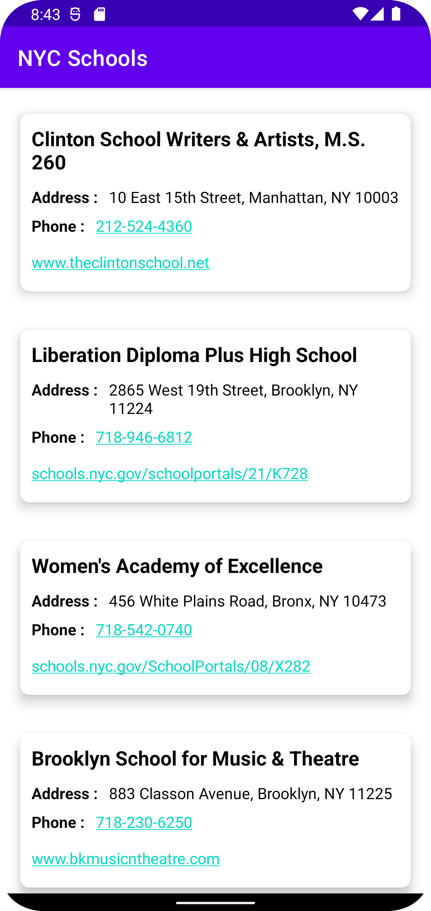
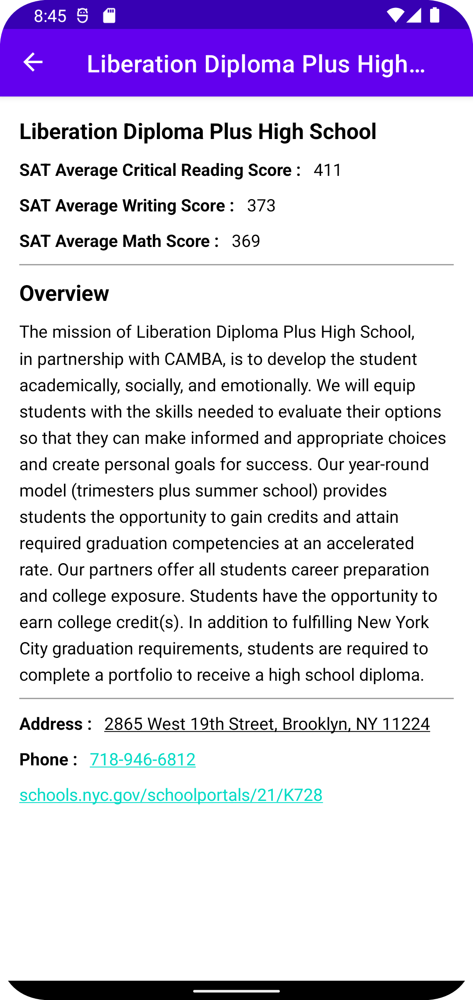

# JP Morgan Android Coding Challenge 
## NYC Schools : Prajkti Khadse 2022-07-11

**GOAL:** Verify candidate can provide a technical solution and follow instructions

### REQUIREMENTS:
These requirements are rather high-level and vague. If details are omitted, it is because we will be
happy with any of a wide variety of solutions. Don't worry about finding "the" solution. Feel free 
to be creative with the requirements. Your goal is to impress (but do so with clean code).

Create a native app to provide information on NYC High schools.

1. Display a list of NYC High Schools.

- Get your data here: 
[High School Directory](https://data.cityofnewyork.us/Education/DOE-High-School-Directory-2017/s3k6-pzi2)

2. Selecting a school should show additional information about the school

- Display all the SAT scores - include Math, Reading and Writing.
SAT data here: 
[SAT Results](https://data.cityofnewyork.us/Education/SAT-Results/f9bf-2cp4)

- It is up to you to decide what additional information to display

When creating a name for your project, please use the following naming convention:
YYYYMMDD-[First&amp;LastName]-NYCSchools (Example: 20180101-DanielleBordner-NYCSchools)

In order to prevent you from running down rabbit holes that are less important to us, try to 
prioritize the following:
### What is Important
- Proper function – requirements met.
- Well-constructed, easy-to-follow, commented code (especially comment hacks or workarounds made 
  in the interest of expediency (i.e. // given more time I would prefer to wrap this in a blah 
  blah blah pattern blah blah )).
- Proper separation of concerns and best-practice coding patterns.
- Defensive code that graciously handles unexpected edge cases.

### What is Less Important
- Demonstrating technologies or techniques you are not already familiar with.

### Bonus Points!
- Unit Tests
- Additional functionality – whatever you see fit.

### Android:
- Make sure you are correctly handing any necessary permissions.
- Please make sure you are using Java. If you want to demonstrate the use of Kotlin, we'd rather 
  you use a combination of both.
- Use Java as the primary language. You can show case your skills in Kotlin if you would like to.

###  NYCSchools : 20220711PrajktiKhadseNYCSchools

NYCSchools is a simple android app using ViewModel & LiveData with Volley in Java.

This app demonstrates the following views and techniques:

* [Volley](https://google.github.io/volley/) to make api calls to an HTTP web service

It leverages the following components from the Jetpack library:

* [ViewModel](https://developer.android.com/topic/libraries/architecture/viewmodel)
* [LiveData](https://developer.android.com/topic/libraries/architecture/livedata)
* [Data Binding](https://developer.android.com/topic/libraries/data-binding/) with binding adapters
* [Navigation](https://developer.android.com/topic/libraries/architecture/navigation/) with the 
  SafeArgs plugin for parameter passing between fragments
  

### Given more time
- Given more time, I would prefer to use [Retrofit](https://square.github.io/retrofit/) networking 
  library with [Moshi](https://github.com/square/moshi) converter that uses less memory and 
  much cleaner code. 
  
- Instead of using ArrayList to save parsed school data, I would use
  [Room](https://developer.android.com/training/data-storage/room) library to save data in 
  local database, that way user will be able to access data even when offline.
  
  ## Screenshots

